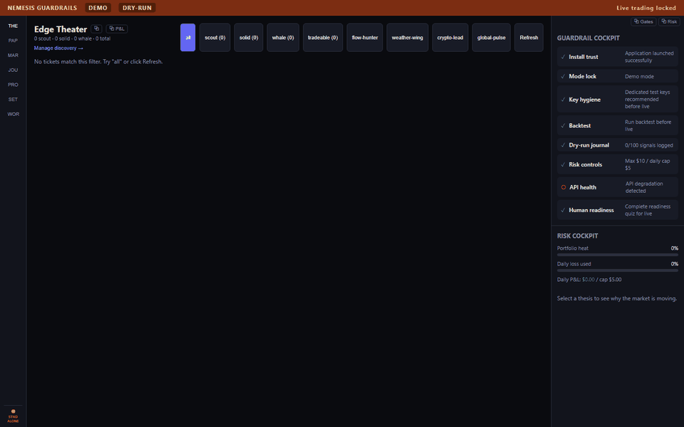

# NEMESIS

[](https://github.com/loganlewisw1112-create/Nemesis/actions/workflows/ci.yml)

**A desktop trading app for Kalshi — the regulated "will this happen?" event market — that refuses to lie to itself about whether it's actually making money.**

NEMESIS watches Kalshi's event contracts (markets like *"Will the Fed cut rates in March?"*), spots the ones it thinks are mispriced, and ranks them by how realistically you could actually place the trade. It runs everything in a practice portfolio first, and it will only record a trade once it can prove — after fees and real-world slippage — that the trade genuinely made money. If it can't prove that, it doesn't trade. Real-money trading ships turned off, behind a deliberately slow unlock.

A companion app, **Global Event Alpha (GEA)**, supplies market intelligence over a secure local connection.

> Experimental software, not financial advice — see the [risk notice](#risk-notice). Recent engineering progress lives in [CHANGELOG.md](CHANGELOG.md).

## Why it's built this way

Most trading demos flatter themselves. They log wins that would never survive real fees, stale prices, or a market too thin to actually trade in. NEMESIS is built on the opposite instinct: **prove it, or don't count it.** Every practice trade has to pass a strict, math-checked profit test before the portfolio will even record it, and ideas that can't pass stay visible as "watch-only" with a plain reason for why. The whole system defaults to caution — practice mode on, real money locked — because the goal was to build something honest, not something that looks good in a screenshot.

## Screenshots

| | |
|---|---|
| **Profit certification** — a suggested trade stays "watch-only" until live prices can prove it would actually make money after costs. |  |
| **Edge Theater** — the ranked list of opportunities, with tiers, filters, and a clear reason next to anything that's blocked. |  |
| **Paper Command Desk** — the practice portfolio: positions, orders, profit and loss, and automatic exit decisions. |  |
| **Global Event Alpha** — the companion intelligence app, mirroring state and feeding recommendations across. |  |

## What it does

- **Finds opportunities.** Scans Kalshi event markets and scores each one on how large the edge is, how clear the outcome is, and how easily you could actually trade it.
- **Ranks by realism.** Sorts candidates into tiers — Scout, Solid, Whale — by how much you could genuinely buy before moving the price against yourself.
- **Only counts proven trades.** A practice trade is recorded only when fresh, real market data can prove a profit after fees and slippage. Fake, stale, or too-thin prices are rejected outright.
- **Explains itself.** Anything that doesn't qualify stays on a watch list with the specific reason it was blocked.
- **Manages exits on its own (on paper).** A module called ProfitOS decides when to take profit or cut a losing practice position.
- **Ships as a Windows desktop app**, packaged and (for real releases) code-signed.

## Playing it safe

NEMESIS is not "live-first." Out of the box:

| | | | | |
| --- | --- | --- | --- | --- |
| Practice mode | On | | Max per position | `$10` |
| Real-money trading | **Off** | | Daily loss cap | `$5` |
| Auto-trading | **Off** | | Practice wallet | `$1,000` |
| Prove-profit-first | On | | Kill switch | always available |

Turning on real money is deliberately hard, and each stage has to be earned:

1. **Practice** — the default.
2. **Manual live** — unlocks only after 50+ practice trades, a 65%+ win rate, healthy risk numbers across the board, and physically typing `ENABLE LIVE MANUAL`.
3. **Auto live** — unlocks only after manual live has proven itself over more trades, plus typing `ENABLE LIVE AUTO`.

The kill switch is on-screen and on `Ctrl+Shift+K`.

---

## Under the hood

*The rest is for engineers; skip it if you just wanted the overview above.*

**The profit gate.** Every paper open and close needs a local, fee-aware `ProfitCertificate` before the portfolio can change. It captures entry/exit price, contracts, fees, modeled slippage, and order-book age, and requires `netPnlUsd ≥ $0.01`. Books must be real, fresh, sanitized, and deep enough to fill the requested side; fallback liquidity, synthetic prices, stale quotes, `0`/`1`/`NaN`, and missing depth are rejected. A throughput engine chases more trades per day by scanning more candidates and retrying temporary blocks — but volume never lowers the bar. GEA can improve discovery and timing; it cannot bypass certification.

**Two apps, one secure bridge.** NEMESIS and GEA talk over an authenticated WebSocket bound to `127.0.0.1`, requiring a token before either sends `bridge:hello` or `nemesis:state`. Every packet is validated fail-closed (role, freshness, confidence, settlement clarity, schema, sequence); unauthenticated, expired, wrong-role, malformed, or low-clarity packets are dropped before they can become tickets or exit actions.

**Layout.**

```text
apps/desktop/              NEMESIS Electron shell, bridge server, IPC, renderer
apps/global-event-alpha/   Companion GEA app, tape engine, SQLite store
packages/bridge-contracts/ Bridge message contracts and fail-closed validation
packages/core/             Kalshi types/client, fees, thesis model, guardrails, live unlock
packages/execution/        Paper desk, live adapter, auto-close engine, audit log
packages/connectors/       Feed hub, Kalshi stream/tape, discovery, public-data mesh
packages/pods/             Signal pods, edge scanner, playbook logic
packages/ui/               Shared cockpit, guardrail, paper-desk, live-unlock components
packages/capital/          Allocator, risk controls, quarantine logic
packages/brain-core/       GEA intelligence, retention, tournament, no-trade logic
packages/simulation-core/  Replay, ticket autopsy, model evaluation
packages/{charts,journal}/ Chart utilities; session journal
```

**Install and run.** Requires Windows 10/11 (packaged target), Node.js 18+, npm, and Git.

```bash
git clone https://github.com/loganlewisw1112-create/Nemesis.git
cd Nemesis
npm ci

npm run dev                                   # NEMESIS; bridge on 127.0.0.1:7430, auto-spawns GEA
npm run dev -w @nemesis/global-event-alpha    # run GEA on its own
```

GEA persists to SQLite (`better-sqlite3`) under `%APPDATA%\@nemesis\global-event-alpha\`. If the native module fails to load after a dependency change, rebuild it: `npm run rebuild:sqlite -w @nemesis/global-event-alpha`. Useful env vars include `NEMESIS_BRIDGE_PORT` (7430), `NEMESIS_BRIDGE_HOST`, `NEMESIS_AUTO_SPAWN_GEA`, and the GEA tape controls (`GEA_TAPE_*`).

**Build, verify, package.**

```bash
# Full local gate before treating a branch as release-ready
npm run ci:typecheck && npm run ci:build && npm run ci:unit && npm run ci:e2e && npm run ci:package && npm run smoke:desktop-pair

npm run package                # Windows installer; signs when CSC_LINK + CSC_KEY_PASSWORD are set
npm run package:local-signed   # build, sign, verify, hash, and stage with a current-user dev cert
```

Packaging builds GEA first, rebuilds `better-sqlite3` for Electron, and bundles GEA into the NEMESIS package (NSIS target). Release/tag CI fails without signing secrets and requires Authenticode `Valid`. A local dev certificate clears `NotSigned` for the current user only — it's not a substitute for a CA-issued certificate for public distribution.

## Risk notice

NEMESIS is experimental software. It is not financial, investment, legal, or tax advice, or a promise of profitable trading. Event-contract trading can lose money quickly, and automated systems can fail on stale data, bad assumptions, bugs, outages, liquidity changes, fee drag, or plain operator error. Use the practice workflows first, and don't enable real-money trading without independent review, dedicated Kalshi credentials, and a loss limit you can afford. Full text in [DISCLAIMER.md](DISCLAIMER.md).

## License

Proprietary, all rights reserved. See [LICENSE](LICENSE).
