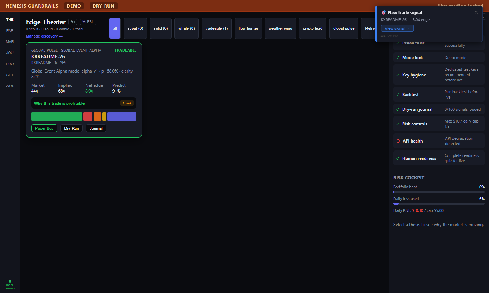
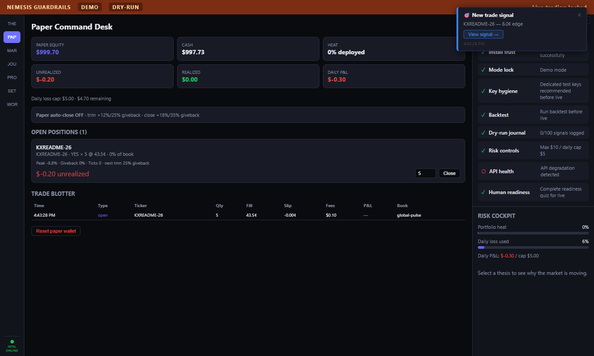
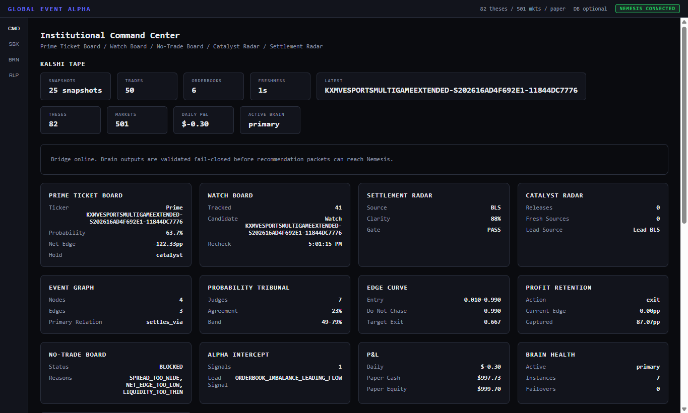

# NEMESIS

NEMESIS is a Kalshi-native desktop trading command center with a companion Global Event Alpha brain. It is built for thesis discovery, paper execution, guardrail-first operations, GEA bridge recommendations, and ProfitOS paper auto-close research.

The app defaults to demo and dry-run behavior. Live trading requires explicit operator unlocks and is not enabled by the ProfitOS auto-close layer.

## Current UI

### NEMESIS Edge Theater

Populated ticket discovery with a live GEA recommendation, tradeability filters, guardrails, and risk cockpit.



### NEMESIS Paper Command Desk

Populated paper desk showing an open paper position, trade blotter, auto-close status, account metrics, and guardrail/risk panels.



### Global Event Alpha Command Center

GEA connected to NEMESIS with mirrored thesis/market state, paper P&L, brain health, ticket boards, retention logic, and fail-closed bridge status.



## What It Does

- Discovers and ranks Kalshi/event-market trade theses.
- Ingests Global Event Alpha recommendation and exit packets over a local WebSocket bridge.
- Scores opportunities by net edge, probability gap, fillable liquidity, freshness, confidence, settlement clarity, bridge latency, spread, and slippage.
- Executes paper buys and paper closes through a dry-run fill model.
- Tracks peak paper P&L, peak edge, giveback, tick count, and GEA exit confidence per open position.
- Supports paper-only ProfitOS auto-trim/auto-close behind an operator setting.
- Reports baseline vs upgraded paper strategy performance with a target of 80% better risk-adjusted net P&L per dollar risked.
- Keeps guardrails, kill switch, API health, readiness gates, and live-order locks visible.

## ProfitOS Auto-Close

ProfitOS is paper-only in this version. It does not place live sell orders.

Default auto-close behavior:

- Off by default and visible in Settings.
- Minimum age: 30 seconds.
- Minimum ticks: 3.
- First trim: 50% of contracts after +12% peak P&L and 25% giveback.
- Final close: remaining contracts after +18% peak P&L and 35% giveback.
- Emergency close: edge gone, stale signal, bad liquidity, or high-confidence GEA exit.
- Decision reasons are pushed into the Paper Desk, trade blotter, notifications, and Profit Station attribution.

## Quickstart

Requires Node.js 18+ and npm.

```bash
npm install
npm run dev
```

`npm run dev` launches the NEMESIS Electron desktop app. NEMESIS can auto-spawn Global Event Alpha, or GEA can be run separately from `apps/global-event-alpha`.

## Scripts

| Command | Description |
| --- | --- |
| `npm run dev` | Launch NEMESIS desktop in development |
| `npm test -- --run` | Run the Vitest suite |
| `npm run typecheck --workspaces --if-present` | Typecheck all workspaces |
| `npm run build -w @nemesis/desktop` | Build NEMESIS desktop |
| `npm run build -w @nemesis/global-event-alpha` | Build Global Event Alpha |
| `npm run test:e2e -w @nemesis/desktop` | Run Electron E2E smoke and bridge tests |
| `npm run package -w @nemesis/desktop` | Build the Windows installer |

## Architecture

```text
apps/desktop/              NEMESIS Electron shell and bridge server
apps/global-event-alpha/   Companion GEA brain desktop app
packages/bridge-contracts/ Fail-closed bridge schemas and validation
packages/core/             Kalshi client, fees, thesis engine, guardrails, paper types
packages/execution/        Paper execution, auto-close engine, benchmarking, live adapter
packages/connectors/       Feed hub, Kalshi stream/tape, public data mesh
packages/pods/             Market signal pods and edge scanner
packages/ui/               Shared React panels and cockpit components
packages/charts/           Profit Station chart utilities
packages/capital/          Allocator, risk controls, strategy quarantine
packages/journal/          Session journal
packages/brain-core/       Institutional intelligence and retention engines
packages/simulation-core/  Replay, ticket autopsy, model tournament
```

## Safety Defaults

- Demo mode on.
- Dry-run on.
- Live trading locked.
- Paper auto-close off until explicitly enabled.
- Kill switch: `Ctrl+Shift+K`.
- GEA bridge packets validate fail-closed before becoming NEMESIS tickets.
- Live auto-close is intentionally out of scope for this version.

## Verification

The current implementation was verified with:

```bash
npm test -- --run
npm run typecheck --workspaces --if-present
npm run build -w @nemesis/desktop
npm run build -w @nemesis/global-event-alpha
npm run test:e2e -w @nemesis/desktop
```

## Disclaimer

NEMESIS is not financial advice. Trading carries risk. Use demo and paper workflows first, validate behavior locally, and do not enable live trading without independent review.
